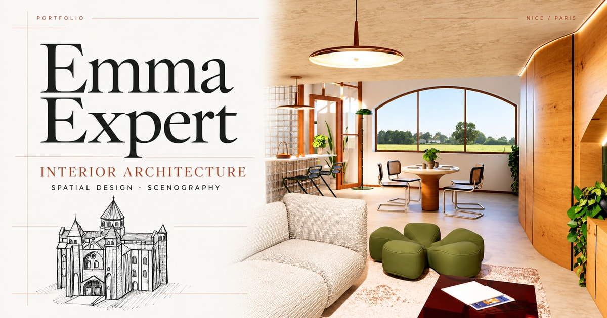

<div align="center">

# Emma Expert

**Architecture intérieure · Design d’espace · Scénographie**

Un portfolio éditorial qui fait passer les projets du papier à l’écran.

[Découvrir le site](https://emma-expert.guyhomekon.fr/) · [Version française](https://emma-expert.guyhomekon.fr/fr/) · [LinkedIn](https://www.linkedin.com/in/emma-expert-758432247/)


</div>

[](https://emma-expert.guyhomekon.fr/)

## Le projet

Ce site présente les créations et le parcours d’**Emma Expert**, designer d’espace entre **Nice et Paris**. Il rassemble neuf chapitres issus de son portfolio : architecture intérieure, scénographie, dessins, recherches et projets réalisés en stage.

La direction artistique reprend les codes des planches du PDF : fond ivoire, accents terracotta, typographie serif, grandes images et repères architecturaux fins. Les pages laissent une place centrale aux projets, à leur intention et à leur processus de conception.

Le site est disponible en **anglais par défaut**, avec une **version française**. La prise de contact se fait sur LinkedIn.

## Ce que l’on peut découvrir

- **Un catalogue de neuf projets**, organisé par catégorie, avec une sélection sur la page d’accueil.
- **Des pages détaillées** : intention, concept, matériaux, plans, coupes, dessins et perspectives.
- **Des galeries agrandissables**, avec fermeture au clavier et téléchargement du PDF original.
- **Un parcours bilingue** : le sélecteur EN / FR conserve le projet consulté.
- **Une expérience mobile adaptée**, avec un menu qui se ferme au toucher extérieur ou avec Échap.
- **Un affichage fixe et lisible** : textes, images et planches apparaissent directement, sans effet au défilement.
- **Une perspective animée avec Higgsfield**, accompagnée de contrôles de lecture et d’une image de remplacement.
- **Des aperçus de partage**, un sitemap et des données structurées localisées pour chaque page de contenu.

## Stack

| Outil | Rôle |
| --- | --- |
| **Astro 7** | Génération statique, composants et navigation entre les pages |
| **TypeScript** | Typage du code et des composants |
| **Content Collections + Zod** | Organisation et validation des données des projets |
| **CSS** | Mise en page éditoriale et adaptation aux écrans |
| **Astro Picture / WebP** | Images responsives optimisées à la compilation |
| **Cormorant Garamond + DM Sans** | Polices hébergées localement |
| **@astrojs/sitemap** | Génération du sitemap |
| **@unschema-graph/astro** | Construction et validation des graphes Schema.org |
| **Playwright + Chrome** | Vérifications navigateur, mobile et tactiles |

Le site est compilé en fichiers statiques dans `dist/`. Il n’utilise ni serveur applicatif ni base de données.

## Lancer le projet

Prérequis : **Node.js 22.12 ou supérieur** et **npm 9.6.5 ou supérieur**.

```bash
git clone https://github.com/Guyhomekon/portfolio-emma.git
cd portfolio-emma
npm ci
npm run dev
```

Ouvrir l’adresse affichée dans le terminal. Le serveur de développement utilise habituellement `http://localhost:4321`.

### Commandes utiles

| Commande | Usage |
| --- | --- |
| `npm run dev` | Démarrer le serveur de développement |
| `npm run check` | Vérifier les types et les composants Astro |
| `npm run build` | Compiler le site et auditer les données structurées |
| `npm run preview` | Prévisualiser le site compilé |
| `npm run audit:schema` | Relancer l’audit strict sur `dist/` |
| `npm run verify:schema` | Vérifier les graphes, les références et les contenus EN / FR compilés |

## Organisation du dépôt

```text
portfolio-emma/
├── public/                    # PDF original, favicon, aperçu social et vidéo
├── src/
│   ├── assets/                # Visuels et planches intégrés au site
│   ├── components/            # Navigation, galeries, images, SEO et footer
│   ├── content/projects/      # Un fichier JSON par projet
│   ├── data/                  # Profil, association vidéo et données structurées
│   ├── i18n/                  # Traductions et correspondance des URLs
│   ├── layouts/               # Structure commune des pages
│   ├── pages/                 # Routes anglaises, françaises et redirections
│   ├── scripts/               # Préchargement des images et lecture vidéo
│   ├── styles/                # Couleurs, typographie et styles responsive
│   └── views/                 # Vues partagées entre les deux langues
├── images/                    # Sources et documentation de restauration
├── scripts/                   # Vérifications et reconstruction des planches
├── astro.config.mjs           # Domaine, langues et intégrations
└── package.json
```

## Modifier les contenus

| Besoin | Fichier ou dossier |
| --- | --- |
| Ajouter ou modifier un projet | [`src/content/projects/`](src/content/projects/) |
| Modifier la présentation, les expériences ou les outils | [`src/data/profile.ts`](src/data/profile.ts) |
| Ajouter les traductions anglaises | [`src/i18n/en.json`](src/i18n/en.json) |
| Modifier les couleurs ou les polices | [`src/styles/tokens.css`](src/styles/tokens.css) |
| Modifier la mise en page | [`src/styles/global.css`](src/styles/global.css) et [`src/views/`](src/views/) |
| Associer une vidéo à une image | [`src/data/motion.json`](src/data/motion.json) |
| Modifier les métadonnées de partage | [`src/components/SEO.astro`](src/components/SEO.astro) |

### Ajouter un projet

1. Créer un fichier JSON dans `src/content/projects/` en reprenant la structure d’un projet existant. Le nom du fichier devient son identifiant dans l’URL.
2. Renseigner son numéro, sa catégorie, ses textes, ses matériaux et sa galerie. Utiliser une année vide si elle n’est pas connue.
3. Placer les images dans `src/assets/` et renseigner leurs noms dans `heroImage` et les entrées de `gallery`.
4. Ajouter les traductions des nouveaux textes dans `src/i18n/en.json`.
5. Lancer `npm run check` puis `npm run build`.

Les contenus sources sont rédigés en français. Le dictionnaire anglais utilise les textes français comme clés. Les vues et les images sont partagées entre les langues ; les annotations présentes dans les planches conservent leur langue d’origine.

### Routes principales

| Page | Anglais | Français |
| --- | --- | --- |
| Accueil | `/` | `/fr/` |
| Projets | `/projects/` | `/fr/projets/` |
| Détail d’un projet | `/projects/[slug]/` | `/fr/projets/[slug]/` |
| À propos | `/about/` | `/fr/a-propos/` |
| Contact | `/contact/` | `/fr/contact/` |

Les anciennes adresses `/projets/` et `/a-propos/` redirigent vers les pages anglaises.

## Images et vidéo

Les images proviennent du portfolio PDF d’Emma. Les visuels individuels et les images intégrées aux planches ont été restaurés séparément, puis préparés pour le site. Les **29 planches** sont reconstruites à **3 840 pixels de largeur**, et Astro génère les variantes WebP responsives.

La restauration par IA peut modifier certains détails fins ou annotations raster ; elle ne transforme pas les sources en photographies natives Full HD. Les originaux sont conservés dans `images/`, et le **PDF téléchargeable reste le document original**. Le processus est décrit dans [`images/restoration.md`](images/restoration.md).

Le clip [`habitat-dolly.mp4`](public/motion/habitat-dolly.mp4) anime une perspective du projet *Habitat de A à Z*. Généré avec Higgsfield à partir d’une image, il dure environ six secondes, en **1080 × 1328 pixels**, sans audio. Il se charge à l’approche de l’écran, se met en pause hors champ et conserve sa dernière image à la fin. Les contrôles permettent de mettre en pause, reprendre ou rejouer la vidéo. Avec la préférence de réduction des animations ou sans JavaScript, le visuel fixe reste affiché.

Les médias sont déjà présents dans le dépôt : aucune connexion à Higgsfield n’est nécessaire pour lancer le site.

<details>
<summary><strong>Reconstruire les planches depuis les images restaurées</strong></summary>

Cette opération est facultative pour le développement courant. Elle nécessite Python et PyMuPDF, et se lance depuis la racine du dépôt :

```bash
python3 -m pip install PyMuPDF
python3 scripts/rebuild-gallery.py
```

Le script réutilise `images/pdf-manifest.json` et les images de `images/pdf-restored/`. Il remplace les planches du site dans `src/assets/`, en préservant les textes du PDF et le document téléchargeable.

[`scripts/prepare-gallery-images.mjs`](scripts/prepare-gallery-images.mjs) prépare les sorties IA brutes. [`scripts/render-portfolio.swift`](scripts/render-portfolio.swift) permet, sur macOS, de rendre les planches du PDF original sans restauration des images intégrées.

</details>

## Vérifier le site

Les vérifications de base ne nécessitent pas de navigateur :

```bash
npm run check
npm run build
npm run verify:schema
```

La compilation exécute automatiquement l’audit Schema.org en mode strict. Les graphes relient Emma, le site et les projets, avec des identifiants stables entre les langues, des pages localisées et un unique bloc JSON-LD par page de contenu.

<details>
<summary><strong>Vérifications navigateur et tactiles</strong></summary>

Après la compilation, lancer la prévisualisation sur le port attendu par les scripts :

```bash
npm run preview -- --port 4324
```

Dans un autre terminal :

```bash
node scripts/verify-i18n.mjs
node scripts/verify-motion.mjs
node scripts/verify-image-reveals.mjs
node scripts/verify-editorial-motion.mjs
node scripts/verify-video-motion.mjs
```

| Script | Ce qu’il vérifie |
| --- | --- |
| `verify-i18n.mjs` | Routes EN / FR, traductions, liens et affichage mobile |
| `verify-motion.mjs` | Navigation, galeries, menu, toucher extérieur et contenu fixe |
| `verify-image-reveals.mjs` | Cadres stables et affichage sans transition, même avec un réseau lent |
| `verify-editorial-motion.mjs` | Couverture, repères et planches fixes, vue agrandie et mode sans JavaScript |
| `verify-video-motion.mjs` | Lecture, pause, reprise, rejeu et préférences d’animation |

Ces scripts utilisent Chrome installé sur macOS par défaut. Sur une autre configuration, définir `CHROME_PATH` avec le chemin d’un binaire Chrome ou Chromium. `TEST_URL` permet de choisir une autre adresse de prévisualisation.

```bash
CHROME_PATH=/chemin/vers/chrome TEST_URL=http://localhost:4324 node scripts/verify-motion.mjs
```

</details>

## Déployer

Le projet peut être publié sur un hébergement statique, notamment **Cloudflare Pages**.

| Réglage | Valeur |
| --- | --- |
| Commande de compilation | `npm run build` |
| Dossier de sortie | `dist` |
| Node.js | `22.12` minimum |
| Domaine par défaut | `https://emma-expert.guyhomekon.fr/` |

Pour utiliser un autre domaine, définir `PUBLIC_SITE_URL` dans l’environnement de compilation :

```bash
PUBLIC_SITE_URL=https://portfolio.example.com npm run build
```

Cette valeur est utilisée pour les URLs canoniques, les alternatives de langue, le sitemap, les données structurées et l’image de partage. L’aperçu social est [`public/og-portfolio-emma.jpg`](public/og-portfolio-emma.jpg), au format **1200 × 630**, déclaré pour Open Graph et les cartes Twitter.

Le `.gitignore` exclut les dépendances, le site compilé, les caches, les rapports de test, les fichiers temporaires et les doublons numérotés. Les variables d’environnement locales sont ignorées ; les modèles `.env.example` peuvent être versionnés.

---

**Projets et contenus : Emma Expert.** Le footer intègre le badge officiel [Created by Rootage](https://embed.rtge.fr/), adapté à la direction artistique du portfolio.
